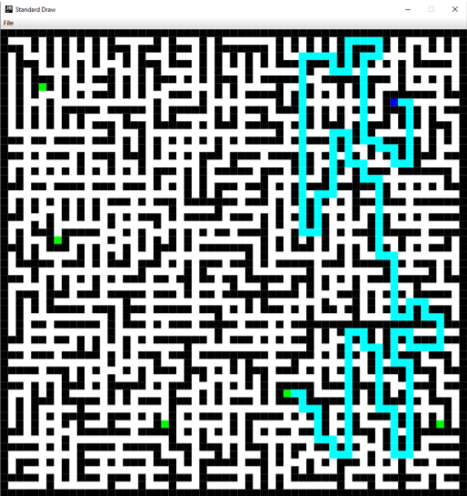

# Pathfinding

## Summary
This is a simple Java application, made to demonstrate the practical uses of different data structures such as:

- Queue
- Stack

and different algorithms such as:

- A*
- Greedy Heuristic Search
- DFS
- BFS

to solve practical issues, such as finding a path from the start of the maze to the "goal". It is also made to demonstrate how effective Java can be, with an OOP approach to solving this problem.

In this case, the blue field is where the maze solver starts, the green field is the field it needs reach. The black fields are obstacles in the maze - so we cannot pass through them. 

## Reading mazes

The app reads simple .txt files - which consist of **n** rows and **n** columns. The columns are separated by commas, with no white space. Each value in a column represents a field. A field can have 3 values:

* -1 (walls or black fields)
* -2 (the start field or blue field)
* -3 (a "goal" field or green field)
*  4 (a passable field or white field)

For an example - check out "labyrinth_1.txt" in the src folder.

## Run the app
From the root folder of the app:  
`cd src`  
`javac Main.java`  
`java Main [maze_file_path] [algorithm]`  

Where algorithm is:
- Greedy
- DFS
- BFS
- As

## Preequisites

You need to have java installed.
